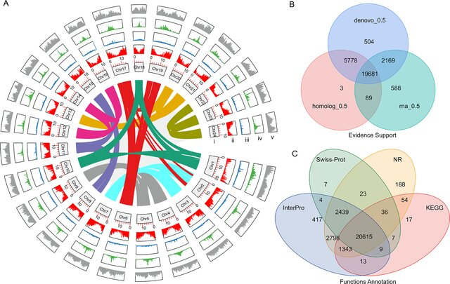
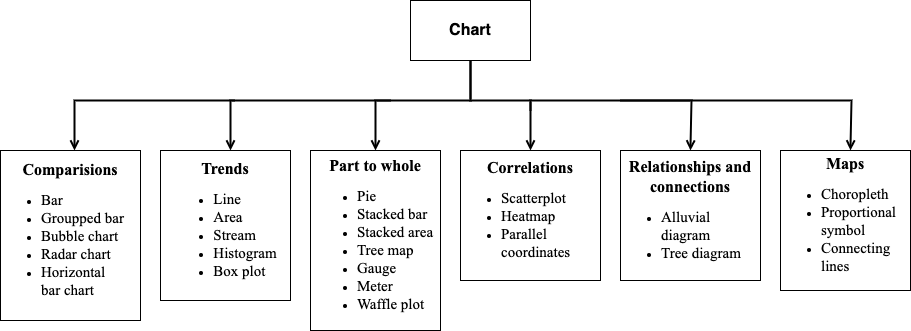
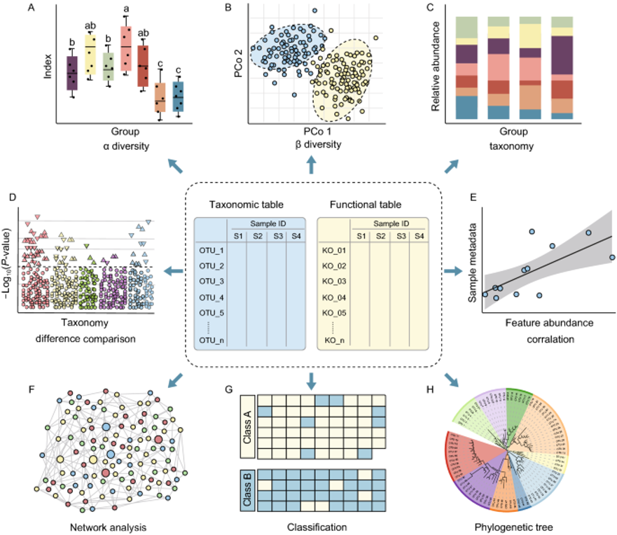
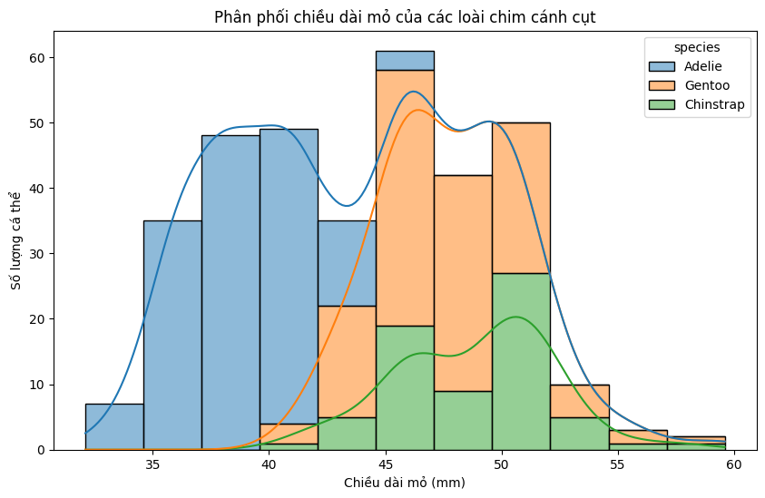
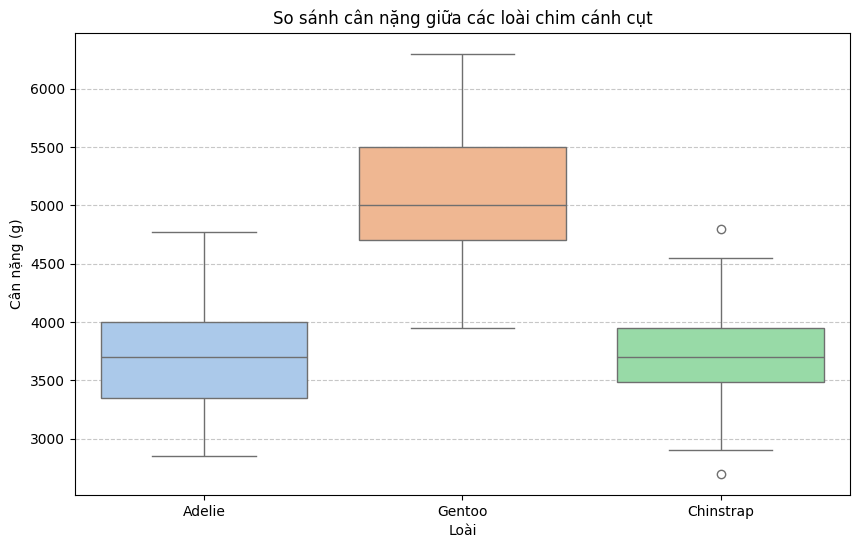
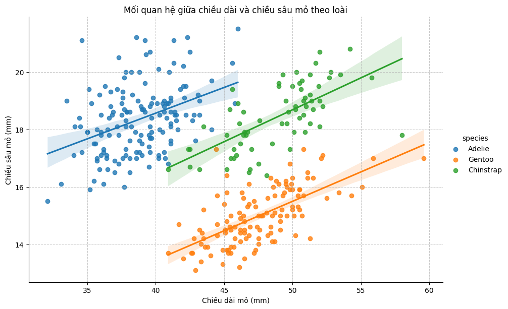
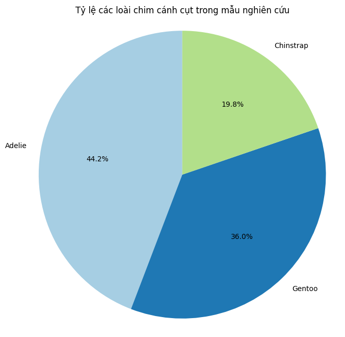
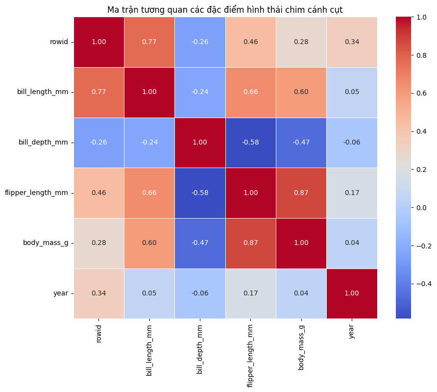

Trực quan hóa dữ liệu
==================

**Dr. Cuong Nguyen**
- CSO, LOBI Corp.
- 2026-08-18

----

# 1 Giới thiệu về Trực quan hóa Dữ liệu (Data Visualization)

## 1.1 Trực quan hóa dữ liệu
- Biểu diễn dữ liệu dưới dạng đồ thị, biểu đồ, bản đồ,...
- Một câu chuyện được truyền đạt qua hình ảnh
- Thể hiện các mô hình (patterns), xu hướng (trends), và sự bất thường (anomalies) trong dữ liệu

Chúng ta cùng "đọc thông tin" từ Hình 1. được lấy từ bài báo Genomic and transcriptomic studies on flavonoid biosynthesis in Lagerstroemia indica (DOI: 10.1186/s12870-024-04776-4) 



*Hình 1: Genome structure and annotation of the Lagerstroemia indica. (A), Circos map of the genome, including (i) the length of the 24 pseudo-chromosomes, (ii) the protein-encoded gene map, (iii) tandem repeat sequences, (iv) transposon-encoded proteins, and (v) transposons. The synteny region of the 24 pseudo-chromosomes is shown by different colors. Minor tick bar = Mb. (B) Gene prediction by three different methods. (C) Gene function annotation in different databases. (DOI: 10.1186/s12870-024-04776-4)* 

## 1.2 Các loại biểu đồ
Có sáu loại biểu đồ chính:
- **So sánh (Comparisons)**: Các dạng trực quan để so sánh các danh mục, ví dụ như biểu đồ cột (bar charts), biểu đồ cột nhóm (grouped bars), biểu đồ bong bóng (bubble charts), biểu đồ radar, và biểu đồ cột ngang.
- **Xu hướng (Trends)**: Các biểu đồ hiển thị sự thay đổi theo thời gian hoặc trình tự, bao gồm biểu đồ đường (line charts), biểu đồ vùng (area charts), biểu đồ dòng chảy (stream graphs), biểu đồ tần suất (histograms), và biểu đồ hộp (box plots).
- **Thành phần trong Tổng thể (Part to Whole)**: Các biểu đồ minh họa cách từng thành phần đóng góp vào tổng thể, chẳng hạn như biểu đồ tròn (pie charts), biểu đồ cột xếp chồng (stacked bars), biểu đồ vùng xếp chồng (stacked areas), sơ đồ cây (tree maps), biểu đồ đo lường (gauges, meters), và biểu đồ dạng lưới (waffle plots).
- **Tương quan (Correlations)**: Trực quan hóa để khám phá mối quan hệ giữa các biến, bao gồm biểu đồ phân tán (scatterplots), bản đồ nhiệt (heatmaps), và tọa độ song song (parallel coordinates).
- **Mối quan hệ và Kết nối (Relationships and Connections)**: Các biểu đồ làm nổi bật các liên kết hoặc dòng chảy, chẳng hạn như biểu đồ dòng chảy (alluvial diagrams) và sơ đồ cây.
- **Bản đồ (Maps)**: Trực quan hóa dữ liệu không gian, bao gồm bản đồ nhiệt phân vùng (choropleth maps), bản đồ ký hiệu tỷ lệ (proportional symbol maps), và các đường kết nối.



*Hình 2: Các loại biểu đồ*



*Hình 3: Trực quan hóa dữ liệu*

## 1.3 Các công cụ Trực quan hóa Dữ liệu phổ biến
- Microsoft Excel
- Tableau
- Microsoft Power BI
- Google Looker Studio
- Python (Matplotlib, Seaborn)
- R (ggplot2 & Tidyverse)

## 1.4 R (ggplot2) so với Python (Matplotlib/Seaborn)
- **R**: Chuyên gia về Phân tích & Đồ họa
- **Python**: Con dao quân đội Thụy Sĩ đa năng

**Chọn R nếu:**
- Công việc hàng ngày của bạn chủ yếu là **phân tích dữ liệu thực nghiệm** (RNA-seq, proteomics, metabolomics, v.v.).
- Bạn cần tạo nhiều **đồ họa phức tạp, chất lượng cao cho các báo cáo và công bố khoa học**.
- Bạn muốn tận dụng hệ sinh thái **Bioconductor** khổng lồ và các phương pháp thống kê tiên tiến.
- Bạn đánh giá cao cách tiếp cận logic và có cấu trúc của **"Ngữ pháp Đồ họa" (Grammar of Graphics)**.

**Chọn Python nếu:**
- Trực quan hóa chỉ là **một bước trong một quy trình lớn hơn** liên quan đến xử lý hình ảnh, học máy, tự động hóa hoặc phát triển phần mềm.
- Bạn cần **tích hợp các phân tích của mình vào một trang web hoặc ứng dụng**.
- Bạn đã quen thuộc với Python và muốn **giữ mọi thứ trong một môi trường**.
- Bạn làm việc nhiều với các mô hình học sâu cho các vấn đề sinh học (ví dụ: AlphaFold).

**Lời khuyên:** Một nhà tin sinh học giỏi thường biết cả hai. Họ có thể sử dụng **R để khám phá, phân tích thống kê và vẽ biểu đồ nhanh**, sau đó chuyển sang **Python để xây dựng các quy trình tự động hoặc các mô hình phức tạp**.

# 2. Matplotlib và Seaborn là gì?

## 2.1 Matplotlib
- Là thư viện cốt lõi (low-level) để vẽ biểu đồ 2D trong Python.
- Cung cấp khả năng kiểm soát chi tiết đến từng yếu tố của biểu đồ (trục, nhãn, màu sắc, chú giải, v.v.).
- Rất mạnh mẽ và linh hoạt nhưng đôi khi cần viết nhiều mã (code) để tạo ra một biểu đồ phức tạp hoặc có tính thẩm mỹ cao.
- Thường được sử dụng làm nền tảng (backend) cho các thư viện đồ họa cấp cao hơn.

## 2.2 Seaborn
- Là thư viện trực quan hóa dữ liệu cấp cao (high-level) được xây dựng dựa trên nền tảng của Matplotlib.
- Cung cấp giao diện lập trình (API) trực quan và dễ sử dụng hơn để vẽ các đồ thị thống kê.
- Tích hợp chặt chẽ và tương tác rất tốt với cấu trúc dữ liệu `DataFrame` của thư viện Pandas.
- Cung cấp sẵn các chủ đề (themes) mặc định và bảng màu (color palettes) đẹp mắt, giúp tạo đồ thị chuẩn xuất bản chỉ với một vài dòng mã.
- Có khả năng tự động thực hiện một số phép tính toán thống kê (ví dụ: vẽ đường hồi quy, tính khoảng tin cậy) trong quá trình vẽ đồ thị.

## 2.3 Khi nào dùng thư viện nào?
- **Ưu tiên sử dụng Seaborn** khi bạn muốn nhanh chóng khám phá dữ liệu, vẽ các đồ thị thống kê phức tạp (ví dụ: phân phối, quan hệ tương quan, so sánh nhóm) từ dữ liệu dạng bảng (DataFrame) một cách dễ dàng và thẩm mỹ.
- **Sử dụng Matplotlib** khi bạn cần can thiệp sâu, tinh chỉnh các chi tiết cụ thể của đồ thị (ví dụ: kích thước hình ảnh, phông chữ, vị trí chính xác của các chú giải), hoặc khi bạn muốn tạo ra những biểu đồ đặc thù, bố cục phức tạp không được hỗ trợ sẵn trong Seaborn.
- **Trong thực tế:** Các nhà phân tích thường kết hợp cả hai. Họ dùng Seaborn để dựng khung đồ thị chính cho nhanh và đẹp, sau đó gọi các hàm của Matplotlib (thông qua đối tượng `Axes` hoặc `Figure`) để tinh chỉnh lại đồ thị cho đúng ý muốn.

# 3 Giới thiệu về Vibe Coding trong Trực quan hóa Dữ liệu

## 3.1 Vibe Coding là gì?
- **Vibe coding** là phong cách lập trình hiện đại, nơi người lập trình sử dụng Trí tuệ Nhân tạo (các trợ lý AI/LLM như Gemini, ChatGPT, Claude, Antigravity, Cursor,...) để tự động sinh mã nguồn thông qua các câu lệnh bằng ngôn ngữ tự nhiên (prompts).
- Thay vì phải ghi nhớ từng cú pháp (syntax) phức tạp của Matplotlib hay Seaborn, bạn tập trung vào việc mô tả **ý đồ phân tích (intent)** và **kết quả mong muốn**.
- Người làm phân tích dữ liệu chuyển vai trò từ người gõ từng dòng code sang **người điều phối (director)** và **người kiểm định (reviewer)**.

## 3.2 Lợi ích của Vibe Coding khi Trực quan hóa Dữ liệu
- **Tốc độ thử nghiệm cực nhanh (Rapid Prototyping)**: Nhanh chóng tạo ra nhiều dạng biểu đồ khác nhau để tìm ra cách truyền đạt dữ liệu tối ưu nhất.
- **Giảm rào cản cú pháp**: Không cần mất thời gian tra cứu tài liệu (documentation) cho các tham số tinh chỉnh giao diện phức tạp (như tùy biến trục, bảng màu, chú thích, font chữ,...).
- **Tập trung vào Tư duy Phân tích (Data Storytelling)**: Dành nhiều thời gian hơn để đọc hiểu ý nghĩa dữ liệu và rút ra tri thức (insights) thay vì sửa lỗi cú pháp.

## 3.3 Quy trình Vibe Coding hiệu quả
1. **Cung cấp ngữ cảnh dữ liệu**: Mô tả cho AI biết cấu trúc dữ liệu của bạn (tên cột, kiểu dữ liệu, một vài dòng mẫu).
2. **Mô tả mục tiêu trực quan hóa**: Nêu rõ bạn muốn xem xét mối quan hệ nào (xu hướng, so sánh, thành phần, tương quan,...).
3. **Thực thi và quan sát**: Chạy đoạn mã do AI tạo ra trong Google Colab / Jupyter Notebook để xem biểu đồ kết quả.
4. **Tinh chỉnh tinh tế (Iterative Prompting)**: Yêu cầu AI chỉnh sửa các chi tiết cụ thể (ví dụ: *"Đổi màu dải phân bố sang xanh lam, xoay nhãn trục X 45 độ và thêm đường kẻ lưới nét đứt"*).
5. **Lưu ý quan trọng**: Biểu đồ AI vẽ ra có thể rất đẹp nhưng vẫn có nguy cơ sai lệch giá trị hoặc nhầm lẫn logic phân tích. Người làm phân tích **luôn phải đối chiếu và kiểm tra tính chính xác của dữ liệu**.

## 3.4 Làm gì khi chưa có ý đồ phân tích?
Khi đứng trước một tập dữ liệu mới mà chưa biết bắt đầu từ đâu hoặc chưa có sẵn câu hỏi/giả thuyết cụ thể, bạn có thể tận dụng AI theo các bước sau để tìm kiếm ý tưởng:

1. **Yêu cầu AI tóm tắt và khám phá tổng quan (EDA - Exploratory Data Analysis)**:
   - Cung cấp cho AI kết quả của `df.info()`, `df.describe()` hoặc 5 dòng đầu `df.head()`.
   - Đặt câu lệnh: *"Hãy tóm tắt đặc điểm tập dữ liệu này, chỉ ra các biến quan trọng, giá trị thiếu (missing values) và gợi ý các hướng khám phá ban đầu."*
2. **Nhờ AI đề xuất các câu hỏi và giả thuyết phân tích**:
   - Đặt câu lệnh: *"Dựa vào cấu trúc dữ liệu trên, hãy gợi ý cho tôi 5 câu hỏi phân tích có giá trị nhất hoặc các giả thuyết có thể kiểm định."*
3. **Tạo đồ thị tổng quan tự động (Overview Dashboard / Quick Scan)**:
   - Yêu cầu AI sinh code vẽ biểu đồ Ma trận Tương quan (Correlation Heatmap) cho các biến số, hoặc Ma trận Phân tán (Pairplot) để nhìn nhanh mối liên hệ giữa các cặp biến.
   - Yêu cầu AI gợi ý và vẽ 3-4 biểu đồ cơ bản nhất đại diện cho các khía cạnh khác nhau của dữ liệu.
4. **Đào sâu theo vệt phát hiện (Drill-down)**:
   - Khi nhìn thấy điểm bất thường (outlier), sự lệch phân bố (skewness) hoặc một xu hướng lạ từ biểu đồ tổng quan, hãy chụp hình hoặc mô tả lại điểm đó cho AI và yêu cầu đào sâu: *"Tôi thấy cột X có phân bố bị lệch phải rất mạnh, hãy gợi ý biểu đồ phân rã hoặc phân nhóm cột X theo cột Y để giải thích nguyên nhân."*

# 4 Giới thiệu về Google Colab

## 4.1 Google Colab là gì?
- **Google Colaboratory (Google Colab)** là môi trường lập trình sổ tay trên nền đám mây (Cloud-based Jupyter Notebook) do Google cung cấp miễn phí.
- Cho phép viết và chạy mã nguồn Python trực tiếp trên trình duyệt web mà không cần phải cài đặt môi trường lập trình phức tạp trên máy tính cá nhân.
- Hỗ trợ phần cứng máy tính mạnh mẽ hoàn toàn miễn phí bao gồm CPU, GPU (Nvidia T4) và TPU, rất thích hợp cho xử lý dữ liệu lớn và học máy (Machine Learning/Deep Learning).

## 4.2 Các ưu điểm vượt trội của Google Colab
- **Không cần cấu hình ban đầu (Zero Configuration)**: Hầu hết các thư viện phân tích và trực quan hóa dữ liệu phổ biến (Pandas, NumPy, Matplotlib, Seaborn, Scikit-learn,...) đã được cài đặt sẵn.
- **Dễ dàng chia sẻ và cộng tác (Collaboration)**: Chia sẻ file notebook (`.ipynb`) tương tự như Google Docs, cho phép làm việc nhóm, nhận xét và chỉnh sửa theo thời gian thực.
- **Tích hợp chặt chẽ với Google Drive**: Dễ dàng kết nối, đọc và lưu trữ các tập dữ liệu directly trên Google Drive.
- **Trình bày báo cáo kết hợp (Rich Text & Code)**: Cho phép kết hợp linh hoạt giữa các dòng mã lệnh Python, biểu đồ trực quan và văn bản giải thích chuẩn Markdown.

# 5 Thực hành với Google Colab

## 5.1 Làm quen với Google Colab
- **Tạo Notebook mới**: Truy cập [colab.research.google.com](https://colab.research.google.com) để khởi tạo một sổ tay phân tích mới.
- **Hai loại Ô (Cell) chính**:
  - **Code Cell**: Ô dùng để viết mã lệnh Python. Nhấn nút `Play` hoặc phím tắt `Shift + Enter` để thực thi.
  - **Text Cell**: Ô dùng để ghi chú, trình bày báo cáo bằng cú pháp Markdown (tiêu đề, in đậm, danh sách, hình ảnh,...).
- **Thực hành thao tác cơ bản**:
  - Tạo một Code Cell, gõ `print("Hello Sinh học!")` rồi nhấn `Shift + Enter` để chạy.
  - Tạo một Text Cell, gõ thử Markdown:
    ```markdown
    # Bài thực hành Trực quan hóa Dữ liệu
    **Họ tên:** Nguyễn Văn A
    - Lớp: Sinh học K26
    - Ngày: 18/08/2026
    ```
- **Gắn thẻ kết nối Google Drive (Mount Drive)**:
  ```python
  from google.colab import drive
  drive.mount('/content/drive')
  ```
- **Cài đặt/Cập nhật thư viện bổ sung**: Sử dụng dấu `!` trước lệnh terminal (như `pip`):
  ```bash
  !pip install seaborn --upgrade
  ```
- **Tải file dữ liệu lên Colab** (2 cách):
  - **Cách 1: Upload trực tiếp** — Nhấn biểu tượng thư mục (📁) bên trái → nút Upload (⬆️) → chọn file CSV từ máy tính.
  - **Cách 2: Từ Google Drive** — Sau khi Mount Drive, truy cập file tại đường dẫn `/content/drive/MyDrive/...`.

## 5.2 Tải và Khám phá Dữ liệu mẫu
Trong phần thực hành này, chúng ta sẽ sử dụng bộ dữ liệu **Palmer Penguins** — dữ liệu đo lường hình thái của 3 loài chim cánh cụt tại quần đảo Palmer, Nam Cực. Đây là bộ dữ liệu sinh học thực tế, rất phổ biến trong giảng dạy phân tích dữ liệu.

**Bộ dữ liệu Palmer Penguins gồm 344 cá thể với các biến:**
- `species`: Loài (Adelie, Chinstrap, Gentoo)
- `island`: Đảo thu mẫu (Torgersen, Biscoe, Dream)
- `bill_length_mm`: Chiều dài mỏ (mm)
- `bill_depth_mm`: Chiều sâu mỏ (mm)
- `flipper_length_mm`: Chiều dài cánh tay (mm)
- `body_mass_g`: Cân nặng (g)
- `sex`: Giới tính (Male, Female)

### Tải dữ liệu

Có 3 phương thức tải dữ liệu lên Google Colab, bao gồm:
- Tải trực tiếp từ Internet thông qua lệnh wget
- Tải từ Google Drive sau khi mount
- Tải trực tiếp từ máy tính cá nhân thông qua biểu tượng thư mục.

Trong bài thực hành, chúng ta sử dụng phương thức thứ 3, **Tải trực tiếp từ máy tính cá nhân thông qua biểu tượng thư mục**. 

- Bước 1: Tải dữ liệu Palmer Penguins về từ [https://github.com/juhuvn/BIC26/blob/main/03-Colab/datasets/palmer_penguins/penguins.csv](https://github.com/juhuvn/BIC26/blob/main/03-Colab/datasets/palmer_penguins/penguins.csv)
- Bước 2: Upload file penguins.csv lên Google Colab thông qua biểu tượng thư mục (📁) bên trái → nút Upload (⬆️) → chọn file penguins.csv từ máy tính.
- Bước 3: Tạo một Code Cell, gõ:
```python
import pandas as pd

# Đọc file penguins.csv
df = pd.read_csv("penguins.csv")

# Xem 5 dòng đầu tiên
df.head()
```

Kết quả thu được 

|index|rowid|species|island|bill\_length\_mm|bill\_depth\_mm|flipper\_length\_mm|body\_mass\_g|sex|year|
|---|---|---|---|---|---|---|---|---|---|
|0|1|Adelie|Torgersen|39\.1|18\.7|181\.0|3750\.0|male|2007|
|1|2|Adelie|Torgersen|39\.5|17\.4|186\.0|3800\.0|female|2007|
|2|3|Adelie|Torgersen|40\.3|18\.0|195\.0|3250\.0|female|2007|
|3|4|Adelie|Torgersen|NaN|NaN|NaN|NaN|NaN|2007|
|4|5|Adelie|Torgersen|36\.7|19\.3|193\.0|3450\.0|female|2007|


Trong trường hợp bạn không tìm thấy thư mục, 
```python
import pandas as pd
import seaborn as sns
import matplotlib.pyplot as plt

# Tải dataset Palmer Penguins có sẵn trong Seaborn
df = sns.load_dataset("penguins")
```

### Khám phá dữ liệu
```python
# Xem 5 dòng đầu tiên
df.head()
```
```python
# Xem thông tin tổng quan: tên cột, kiểu dữ liệu, giá trị thiếu
df.info()
```

Kết quả:

```
<class 'pandas.core.frame.DataFrame'>
RangeIndex: 344 entries, 0 to 343
Data columns (total 9 columns):
 #   Column             Non-Null Count  Dtype  
---  ------             --------------  -----  
 0   rowid              344 non-null    int64  
 1   species            344 non-null    object 
 2   island             344 non-null    object 
 3   bill_length_mm     342 non-null    float64
 4   bill_depth_mm      342 non-null    float64
 5   flipper_length_mm  342 non-null    float64
 6   body_mass_g        342 non-null    float64
 7   sex                333 non-null    object 
 8   year               344 non-null    int64  
dtypes: float64(4), int64(2), object(3)
memory usage: 24.3+ KB
```

```python
# Thống kê mô tả các biến số
df.describe()
```

Kết quả:

|index|rowid|bill\_length\_mm|bill\_depth\_mm|flipper\_length\_mm|body\_mass\_g|year|
|---|---|---|---|---|---|---|
|count|344\.0|342\.0|342\.0|342\.0|342\.0|344\.0|
|mean|172\.5|43\.9219298245614|17\.151169590643274|200\.91520467836258|4201\.754385964912|2008\.0290697674418|
|std|99\.44847912361456|5\.4595837139265315|1\.9747931568167818|14\.061713679356888|801\.9545356980958|0\.8183559254837027|
|min|1\.0|32\.1|13\.1|172\.0|2700\.0|2007\.0|
|25%|86\.75|39\.225|15\.6|190\.0|3550\.0|2007\.0|
|50%|172\.5|44\.45|17\.3|197\.0|4050\.0|2008\.0|
|75%|258\.25|48\.5|18\.7|213\.0|4750\.0|2009\.0|
|max|344\.0|59\.6|21\.5|231\.0|6300\.0|2009\.0|

```python
# Đếm số lượng cá thể theo loài
df['species'].value_counts()
```

Kết quả:

| species | count |
|---|---|
| Adelie | 152 |
| Gentoo | 124 |
| Chinstrap | 68 |

```python
# Kiểm tra giá trị thiếu (missing values)
df.isnull().sum()
```

Kết quả:

|columns | missing values |
|---|---|
| rowid | 0 |
| species | 0 |
| island | 0 |
| bill_length_mm | 2 |
| bill_depth_mm | 2 |
| flipper_length_mm | 2 |
| body_mass_g | 2 |
| sex | 11 |
| year | 0 |

> **Lưu ý:** Bộ dữ liệu penguins có một số giá trị thiếu (missing values). Đây là tình huống rất phổ biến trong dữ liệu sinh học thực tế.

## 5.3 Vẽ biểu đồ cơ bản với Vibe Coding

Trong phần này, sinh viên sẽ thực hành **Vibe Coding**: thay vì gõ từng dòng code, bạn sẽ **mô tả biểu đồ mong muốn bằng tiếng Việt** cho AI (Gemini trong Colab) và để AI sinh code cho bạn.

**Quy trình cho mỗi bài tập:**
1. Đọc yêu cầu bài tập và mục tiêu phân tích
2. Viết prompt (câu lệnh) bằng tiếng Việt mô tả biểu đồ muốn vẽ
3. AI sinh code → Copy vào Code Cell → Nhấn `Shift + Enter`
4. Quan sát kết quả và tinh chỉnh bằng prompt tiếp theo

---

### Bài tập 1: Biểu đồ Phân phối (Distribution)

**Câu hỏi sinh học:** *Chiều dài mỏ của 3 loài chim cánh cụt phân bố như thế nào? Có sự chồng lấn (overlap) giữa các loài không?*

**Prompt mẫu:**
> Tôi có DataFrame `df` chứa dữ liệu Palmer Penguins (đã load bằng `df = pd.read_csv("penguins.csv")`). Hãy vẽ biểu đồ histogram thể hiện phân phối chiều dài mỏ (`bill_length_mm`) của các loài chim cánh cụt, phân biệt theo cột `species` bằng màu sắc khác nhau. Thêm tiêu đề và nhãn trục bằng tiếng Việt.

**Gợi ý quan sát kết quả:**
- Loài nào có mỏ dài nhất trung bình?
- Phân phối có bị lệch (skewed) không?
- Vùng chồng lấn giữa các loài cho thấy điều gì về khả năng phân biệt loài dựa trên chiều dài mỏ?

Code sinh ra

```python
import matplotlib.pyplot as plt
import seaborn as sns

plt.figure(figsize=(10, 6))
sns.histplot(data=df, x='bill_length_mm', hue='species', multiple='stack', kde=True)
plt.title('Phân phối chiều dài mỏ của các loài chim cánh cụt')
plt.xlabel('Chiều dài mỏ (mm)')
plt.ylabel('Số lượng cá thể')
plt.show()
```

Kết quả



---

### Bài tập 2: Biểu đồ So sánh (Comparison)

**Câu hỏi sinh học:** *Cân nặng trung bình khác biệt bao nhiêu giữa 3 loài? Sự biến thiên (variability) trong mỗi loài ra sao?*

**Prompt mẫu:**
> Dùng dữ liệu `df` (Palmer Penguins). Vẽ box plot so sánh cân nặng (`body_mass_g`) giữa 3 loài chim cánh cụt (cột `species`). Thêm tiêu đề "So sánh cân nặng giữa các loài chim cánh cụt", nhãn trục X là "Loài", nhãn trục Y là "Cân nặng (g)". Dùng bảng màu pastel.

**Prompt tinh chỉnh (tùy chọn):**
> Đổi sang violin plot để thấy rõ hơn hình dạng phân phối, thêm các điểm dữ liệu riêng lẻ (strip plot) phía trên.

**Gợi ý quan sát kết quả:**
- Loài nào có cân nặng lớn nhất? Nhỏ nhất?
- Loài nào có sự biến thiên cân nặng lớn nhất (hộp rộng nhất)?
- Có outlier (điểm ngoại lai) không?

Code:

```python
import matplotlib.pyplot as plt
import seaborn as sns

plt.figure(figsize=(10, 6))
sns.boxplot(data=df, x='species', y='body_mass_g', hue='species', palette='pastel', legend=False)
plt.title('So sánh cân nặng giữa các loài chim cánh cụt')
plt.xlabel('Loài')
plt.ylabel('Cân nặng (g)')
plt.grid(axis='y', linestyle='--', alpha=0.7)
plt.show()
```

Kết quả:



---

### Bài tập 3: Biểu đồ Tương quan (Correlation)

**Câu hỏi sinh học:** *Có mối quan hệ nào giữa chiều dài mỏ và chiều sâu mỏ không? Mối quan hệ này có khác nhau giữa các loài không?*

**Prompt mẫu:**
> Dùng dữ liệu `df` (Palmer Penguins). Vẽ scatter plot thể hiện mối quan hệ giữa chiều dài mỏ (`bill_length_mm`, trục X) và chiều sâu mỏ (`bill_depth_mm`, trục Y), phân biệt theo loài (`species`) bằng màu sắc khác nhau, thêm đường hồi quy (regression line) cho mỗi loài.

**Gợi ý quan sát kết quả:**
- Nhìn tổng thể (bỏ qua loài), có vẻ như mỏ dài hơn thì sâu hơn hay nông hơn? → Đây là ví dụ kinh điển về **Nghịch lý Simpson (Simpson's Paradox)**.
- Khi tách riêng từng loài, xu hướng có đảo ngược không?
- Loài nào có mối tương quan mạnh nhất giữa chiều dài và chiều sâu mỏ?

Code: 

```python
import matplotlib.pyplot as plt
import seaborn as sns

# Sử dụng lmplot để có đường hồi quy cho từng loài
sns.lmplot(data=df, x='bill_length_mm', y='bill_depth_mm', hue='species', height=6, aspect=1.5)
plt.title('Mối quan hệ giữa chiều dài và chiều sâu mỏ theo loài')
plt.xlabel('Chiều dài mỏ (mm)')
plt.ylabel('Chiều sâu mỏ (mm)')
plt.grid(True, linestyle='--', alpha=0.7)
plt.show()
```

Kết quả:




---

### Bài tập 4: Biểu đồ Thành phần (Part-to-Whole)

**Câu hỏi sinh học:** *Tỷ lệ 3 loài chim cánh cụt trong mẫu nghiên cứu là bao nhiêu? Mẫu có cân bằng (balanced) không?*

**Prompt mẫu:**
> Dùng dữ liệu `df` (Palmer Penguins). Vẽ biểu đồ tròn (pie chart) thể hiện tỷ lệ phần trăm 3 loài chim cánh cụt trong dataset. Hiển thị phần trăm trên mỗi phần, thêm tiêu đề "Tỷ lệ các loài chim cánh cụt trong mẫu nghiên cứu". Dùng bảng màu đẹp.

**Gợi ý quan sát kết quả:**
- Mẫu nghiên cứu có cân bằng giữa 3 loài không?
- Nếu mẫu không cân bằng, điều này ảnh hưởng gì đến các phân tích so sánh?

Code:

```python
import matplotlib.pyplot as plt

# Đếm số lượng cá thể theo loài
species_counts = df['species'].value_counts()

# Tạo biểu đồ tròn
plt.figure(figsize=(8, 8))
plt.pie(species_counts, labels=species_counts.index, autopct='%1.1f%%', startangle=90, colors=plt.cm.Paired.colors)
plt.title('Tỷ lệ các loài chim cánh cụt trong mẫu nghiên cứu')
plt.axis('equal') # Đảm bảo biểu đồ tròn không bị méo
plt.show()
```

Kết quả:



---

### Bài tập 5: Ma trận tương quan (Heatmap)

**Câu hỏi sinh học:** *Trong tất cả các đặc điểm hình thái (chiều dài mỏ, chiều sâu mỏ, chiều dài cánh, cân nặng), cặp nào có mối tương quan mạnh nhất?*

**Prompt mẫu:**
> Dùng dữ liệu `df` (Palmer Penguins). Tính ma trận tương quan (correlation matrix) của tất cả các biến số trong dataset và vẽ heatmap. Hiển thị giá trị hệ số tương quan (r) trên từng ô, dùng bảng màu `coolwarm`, thêm tiêu đề "Ma trận tương quan các đặc điểm hình thái chim cánh cụt".

**Gợi ý quan sát kết quả:**
- Cặp biến nào có tương quan dương mạnh nhất (giá trị r gần +1)?
- Cặp biến nào có tương quan âm (giá trị r âm)?
- Kết quả này có phù hợp với hiểu biết sinh học của bạn không? (Ví dụ: chim nặng hơn thường có cánh dài hơn?)

Code:

```python
import matplotlib.pyplot as plt
import seaborn as sns

# Chọn các cột số học từ DataFrame
df_numeric = df.select_dtypes(include=['number'])

# Tính toán ma trận tương quan
correlation_matrix = df_numeric.corr()

# Tạo heatmap
plt.figure(figsize=(10, 8))
sns.heatmap(correlation_matrix, annot=True, cmap='coolwarm', fmt='.2f', linewidths=.5)
plt.title('Ma trận tương quan các đặc điểm hình thái chim cánh cụt')
plt.show()
```

Kết quả:



## 5.4 Tinh chỉnh biểu đồ bằng Vibe Coding

Sau khi có biểu đồ cơ bản, kỹ năng quan trọng tiếp theo là **tinh chỉnh** để biểu đồ chuyên nghiệp và truyền tải thông tin rõ ràng hơn. Thay vì phải nhớ cú pháp Matplotlib phức tạp, bạn chỉ cần mô tả yêu cầu tinh chỉnh cho AI.

**Bảng tham khảo các yêu cầu tinh chỉnh thường gặp:**

| Yêu cầu | Prompt mẫu |
|----------|------------|
| Thay đổi kích thước hình | *"Đặt kích thước hình ảnh 12×6 inches"* |
| Thay đổi bảng màu | *"Đổi bảng màu sang 'Set2' của seaborn"* |
| Thêm tiêu đề/nhãn tiếng Việt | *"Thêm tiêu đề 'Phân phối cân nặng theo loài', nhãn trục X là 'Loài', trục Y là 'Cân nặng (g)'"* |
| Xoay nhãn trục | *"Xoay nhãn trục X 45 độ để tránh chồng chữ"* |
| Thêm lưới nền | *"Thêm đường kẻ lưới nét đứt, màu xám nhạt"* |
| Lưu ảnh chất lượng cao | *"Lưu biểu đồ dưới dạng file PNG với DPI 300"* |
| Bố cục nhiều biểu đồ | *"Vẽ 4 biểu đồ trên cùng 1 hình, bố cục 2 hàng × 2 cột"* |
| Thêm chú thích | *"Thêm mũi tên chỉ vào điểm có giá trị cao nhất và ghi chú 'Giá trị cực đại'"* |
| Định dạng chuẩn xuất bản | *"Định dạng theo chuẩn journal: font Arial 12pt, DPI 300, kích thước 8×6 inches, bỏ viền trên và phải (despine)"* |

**Thực hành:** Chọn một biểu đồ từ Bài tập 1–5 và áp dụng ít nhất 3 yêu cầu tinh chỉnh từ bảng trên. Quan sát sự thay đổi sau mỗi lần tinh chỉnh.

## 5.5 Bài tập tổng hợp: Khám phá Dữ liệu (EDA) với Vibe Coding

> Bài tập này mô phỏng quy trình phân tích dữ liệu thực tế, áp dụng trực tiếp quy trình đã học ở §3.4 "Làm gì khi chưa có ý đồ phân tích".

**Kịch bản:** Bạn nhận được một bộ dữ liệu sinh học mới mà bạn chưa biết gì về nó. Hãy sử dụng AI để khám phá dữ liệu theo các bước sau:

### Bước 1: Tải dữ liệu và tóm tắt tổng quan
- Tải một dataset mới (ví dụ: `sns.load_dataset("healthexp")` hoặc file CSV do giảng viên cung cấp).
- Chạy `df.head()`, `df.info()`, `df.describe()`.
- **Prompt cho AI:** *"Đây là kết quả `df.info()` và `df.describe()` của bộ dữ liệu tôi đang phân tích: [paste kết quả]. Hãy tóm tắt đặc điểm chính, chỉ ra các biến quan trọng và giá trị thiếu."*

### Bước 2: Nhờ AI đề xuất câu hỏi phân tích
- **Prompt cho AI:** *"Dựa vào cấu trúc dữ liệu trên, hãy gợi ý cho tôi 5 câu hỏi phân tích có giá trị nhất hoặc các giả thuyết có thể kiểm định bằng biểu đồ."*

### Bước 3: Chọn câu hỏi và vẽ biểu đồ
- Chọn 2 câu hỏi từ danh sách AI gợi ý.
- Yêu cầu AI vẽ biểu đồ trả lời cho từng câu hỏi.
- Chạy code và quan sát kết quả.

### Bước 4: Tinh chỉnh 1 biểu đồ cho đẹp
- Chọn 1 biểu đồ yêu thích, áp dụng các kỹ thuật tinh chỉnh đã học ở §5.4.
- Mục tiêu: tạo ra biểu đồ đạt chuẩn có thể đưa vào báo cáo hoặc poster khoa học.

### Bước 5: Viết giải thích phát hiện
- Tạo một **Text Cell** (Markdown) ngay bên dưới biểu đồ.
- Viết 3–5 câu giải thích phát hiện (finding) từ biểu đồ, bao gồm:
  - Bạn đã quan sát được xu hướng/mẫu (pattern) gì?
  - Có điểm bất thường (anomaly) hay kết quả bất ngờ nào không?
  - Phát hiện này có ý nghĩa sinh học gì?

## 5.6 Xuất kết quả và chia sẻ

### Lưu biểu đồ dưới dạng hình ảnh
```python
# Lưu biểu đồ vừa vẽ dưới dạng PNG chất lượng cao
plt.savefig('bieu_do_phan_phoi.png', dpi=300, bbox_inches='tight')

# Lưu dưới dạng SVG (vector, phóng to không vỡ — tốt cho poster/bài báo)
plt.savefig('bieu_do_phan_phoi.svg', format='svg', bbox_inches='tight')

# Lưu dưới dạng PDF
plt.savefig('bieu_do_phan_phoi.pdf', format='pdf', bbox_inches='tight')
```

### Lưu biểu đồ vào Google Drive
```python
# Lưu trực tiếp vào Google Drive (sau khi đã mount)
plt.savefig('/content/drive/MyDrive/bieu_do_phan_phoi.png', dpi=300, bbox_inches='tight')
```

### Download Notebook
- **Cách 1:** Vào menu **File** → **Download** → **Download .ipynb** (file notebook gốc).
- **Cách 2:** Vào menu **File** → **Download** → **Download .py** (file Python thuần).

### Chia sẻ Notebook
- Nhấn nút **Share** (góc trên bên phải) → chia sẻ tương tự Google Docs.
- Người nhận có thể xem, comment hoặc chỉnh sửa tùy quyền bạn cấp.
- File notebook tự động lưu trên Google Drive tại thư mục **Colab Notebooks**.

### Xuất Notebook sang PDF (để nộp bài)
- **Cách 1:** Vào menu **File** → **Print** → Chọn **Save as PDF**.
- **Cách 2:** Sử dụng code:
  ```bash
  !apt-get install -y texlive-xetex texlive-fonts-recommended
  !jupyter nbconvert --to pdf /content/ten_notebook.ipynb
  ```

# 6 Mở rộng: Biểu đồ Tương tác với Plotly (Tùy chọn)

## 6.1 Plotly Express là gì?
- **Plotly Express** là thư viện trực quan hóa tạo ra các biểu đồ **tương tác (interactive)**: người xem có thể di chuột (hover) để xem chi tiết, phóng to/thu nhỏ (zoom), bật/tắt từng nhóm dữ liệu.
- Rất phù hợp cho việc **trình bày kết quả** và **khám phá dữ liệu** vì cho phép tương tác trực tiếp với biểu đồ.

## 6.2 Thực hành với Plotly
**Prompt mẫu:**
> Dùng dữ liệu `df` (Palmer Penguins). Vẽ scatter plot **tương tác bằng Plotly Express** thể hiện mối quan hệ giữa `bill_length_mm` (trục X) và `body_mass_g` (trục Y), phân biệt theo `species` bằng màu. Khi di chuột vào điểm sẽ hiện thông tin: loài, đảo, giới tính, chiều dài mỏ, cân nặng.

**So sánh với Matplotlib/Seaborn:**
- Matplotlib/Seaborn: biểu đồ tĩnh (static), phù hợp cho bài báo, poster in ấn.
- Plotly: biểu đồ tương tác (interactive), phù hợp cho slide trình bày, dashboard, và khám phá dữ liệu.

# 7 Mở rộng: Sử dụng Dữ liệu Thực từ Nghiên cứu (Tùy chọn)

## 7.1 Nguồn dữ liệu sinh học mở
Trong nghiên cứu thực tế, bạn sẽ cần làm việc với dữ liệu "chưa sạch" từ các nguồn mở:

| Nguồn dữ liệu | Mô tả | Loại dữ liệu |
|----------------|--------|---------------|
| [GEO (Gene Expression Omnibus)](https://www.ncbi.nlm.nih.gov/geo/) | Cơ sở dữ liệu biểu hiện gen | RNA-seq, Microarray |
| [Kaggle](https://www.kaggle.com/datasets?tags=13302-Biology) | Datasets sinh học đa dạng | CSV, nhiều định dạng |
| [WHO Data](https://data.who.int/) | Dữ liệu y tế toàn cầu | Dịch tễ, sức khỏe cộng đồng |
| [UniProt](https://www.uniprot.org/) | Cơ sở dữ liệu protein | Trình tự, chức năng protein |
| [GBIF](https://www.gbif.org/) | Dữ liệu đa dạng sinh học toàn cầu | Phân bố loài, sinh thái |

## 7.2 Thực hành với dữ liệu thực
**Prompt mẫu:**
> Tôi có file CSV chứa dữ liệu biểu hiện gen với các cột: gene_name, sample_1, sample_2, ..., sample_10, condition (control/treatment). Hãy giúp tôi: (1) kiểm tra dữ liệu thiếu, (2) vẽ heatmap top 20 gen có biểu hiện khác biệt lớn nhất giữa 2 nhóm, (3) vẽ volcano plot nếu có cột log2FC và p_value.

# 8 Mở rộng: Biểu đồ Chuẩn Xuất bản Khoa học (Tùy chọn)

## 8.1 Tiêu chuẩn biểu đồ trong bài báo khoa học
Khi tạo biểu đồ cho bài báo, poster, hay luận văn, cần tuân thủ một số tiêu chuẩn:
- **Độ phân giải**: Tối thiểu 300 DPI (dots per inch)
- **Font chữ**: Arial hoặc Helvetica, cỡ 8–12pt
- **Kích thước**: Thường 8×6 inches (full-width) hoặc 4×3 inches (half-width)
- **Màu sắc**: Nên dùng bảng màu thân thiện với người mù màu (colorblind-friendly), ví dụ: `colorblind`, `Set2`
- **Viền**: Bỏ viền trên và phải (despine) để gọn gàng
- **Định dạng file**: PNG (cho web), SVG/PDF (cho in ấn, vector)

## 8.2 Prompt mẫu định dạng chuẩn journal
> Hãy định dạng lại biểu đồ trên theo chuẩn xuất bản khoa học: font Arial 10pt, DPI 300, kích thước 8×6 inches, bỏ viền trên và phải (sns.despine), bảng màu colorblind-friendly, lưu dưới dạng cả PNG và SVG.

---

# Phụ lục: Gợi ý phân bổ thời gian buổi học (3–4 tiếng)

| Thời gian | Nội dung | Hình thức |
|-----------|----------|-----------|
| 30 phút | §1–2: Lý thuyết trực quan hóa + Matplotlib/Seaborn | Giảng + Slide |
| 15 phút | §3: Giới thiệu Vibe Coding (demo live) | Demo trực tiếp |
| 15 phút | §4 + §5.1: Giới thiệu Colab + Làm quen thao tác | Thực hành có hướng dẫn |
| 15 phút | §5.2: Tải và khám phá dữ liệu | Thực hành có hướng dẫn |
| 60 phút | §5.3 + §5.4: Vẽ biểu đồ + Tinh chỉnh bằng Vibe Coding | Thực hành tự do + Q&A |
| 30 phút | §5.5: Bài tập tổng hợp EDA | Thực hành nhóm |
| 15 phút | §5.6: Xuất kết quả + Tổng kết | Hướng dẫn + Wrap-up |
| *(Tùy chọn)* | §6–8: Plotly / Dữ liệu thực / Chuẩn xuất bản | Mở rộng nếu còn thời gian |
